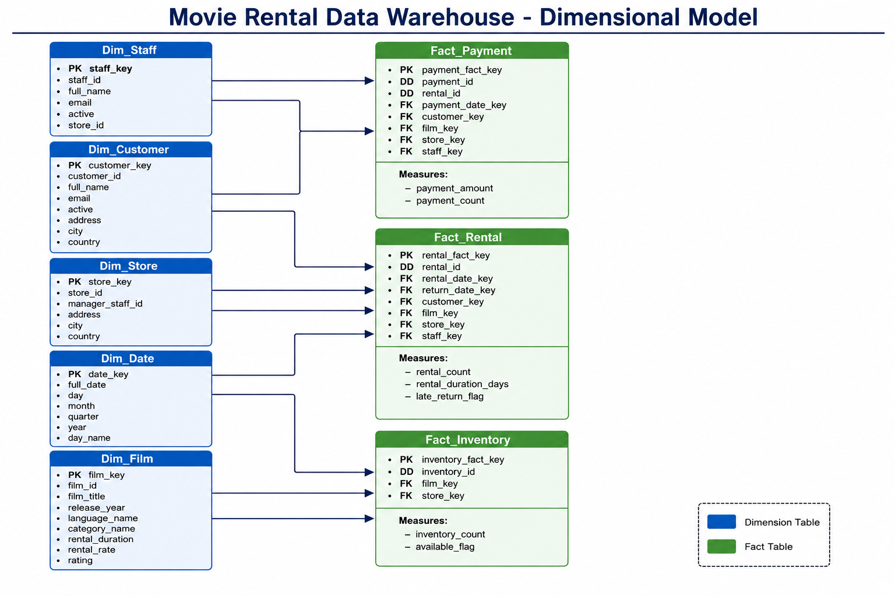
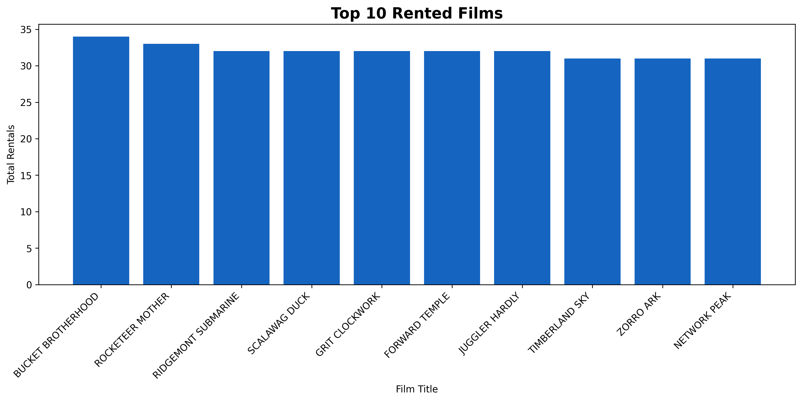
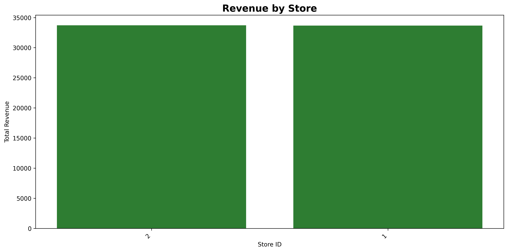
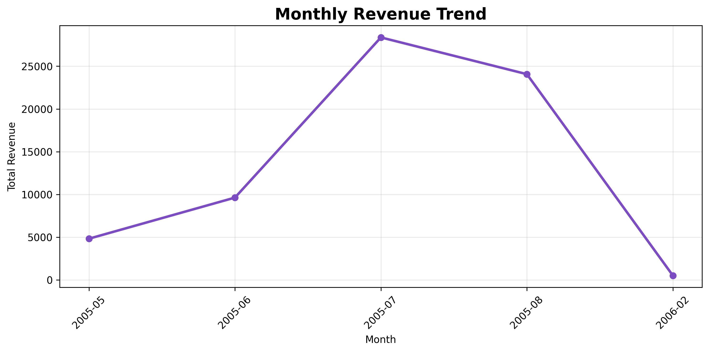
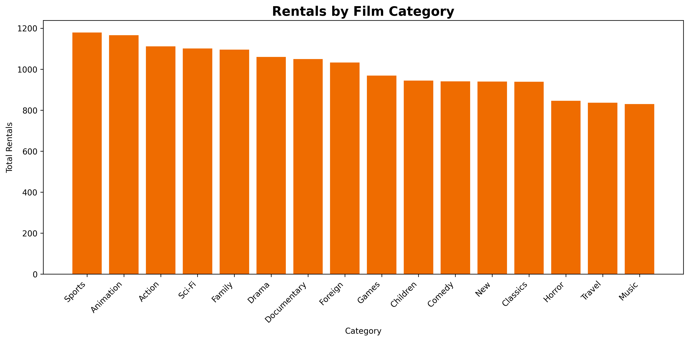
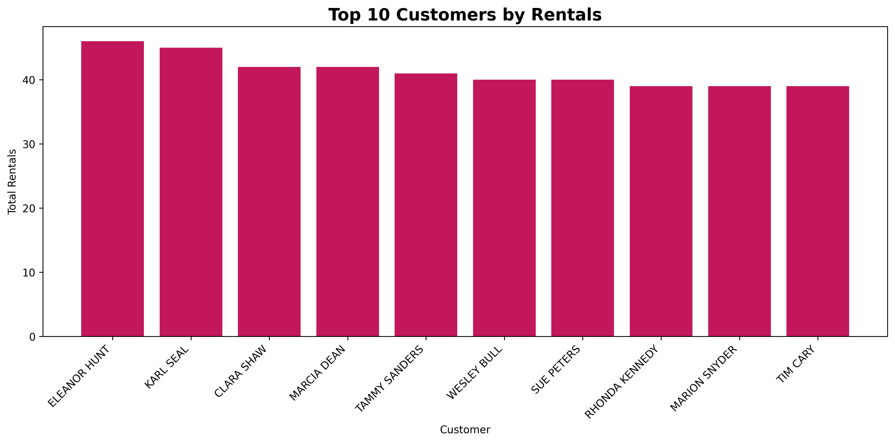

# Movie Rental Data Warehouse

## Project Overview

This project implements a complete Data Warehouse solution for the Sakila Movie Rental database using Python, MySQL, and Pandas.

The project follows the ETL process:

- Extract data from the OLTP database
- Transform and clean the data
- Load the transformed data into a dimensional Data Warehouse

The warehouse supports analytical queries and business intelligence reporting.

---

# Technologies Used

- Python
- Pandas
- MySQL
- SQLAlchemy
- PyMySQL
- Matplotlib

---

# Project Structure

```bash
movie-rental-dw-design/
│
├── app.py
├── requirements.txt
├── README.md
│
├── pipeline/
│   ├── extract_stage.py
│   ├── transform_stage.py
│   ├── load_stage.py
│   ├── create_diagram.py
│   └── create_charts.py
│
├── transformed_data/
├── visuals/
├── database_scripts/
└── documentation/
```

---

# Data Warehouse Design

The project uses a dimensional model with:

## Fact Tables

- fact_rental
- fact_payment
- fact_inventory

## Dimension Tables

- dim_customer
- dim_film
- dim_date
- dim_store
- dim_staff
- dim_actor
- dim_category

## Bridge Tables

- bridge_film_actor
- bridge_film_category

---

# ETL Process

## Extract Stage

Data is extracted from the Sakila OLTP database using SQL queries and SQLAlchemy.

## Transform Stage

The transformation process includes:

- Data cleaning
- Creating surrogate keys
- Combining customer names
- Building dimension tables
- Building fact tables
- Creating bridge tables
- Calculating rental duration
- Creating late return flags

## Load Stage

The transformed tables are loaded into the Data Warehouse database.

---

# Business Questions

The Data Warehouse helps answer important business questions such as:

- What are the most rented films?
- Which store generates the highest revenue?
- What are the most popular film categories?
- How does revenue change over time?
- Who are the top customers by rentals?

---

# Dimensional Model Diagram



---

# Charts and Analytics

## Top Rented Films



---

## Revenue by Store



---

## Monthly Revenue Trend



---

## Rentals by Film Category



---

## Top Customers by Rentals



---

# How to Run the Project

## Install Requirements

```bash
pip install -r requirements.txt
```

## Run ETL Pipeline

```bash
py app.py
```

## Generate Charts

```bash
py pipeline/create_charts.py
```

## Generate Dimensional Model Diagram

```bash
py pipeline/create_diagram.py
```

---

# Sample SQL Queries

## Show Top Rented Films

```sql
SELECT
    f.film_title,
    COUNT(r.rental_fact_key) AS total_rentals
FROM fact_rental r
JOIN dim_film f
ON r.film_key = f.film_key
GROUP BY f.film_title
ORDER BY total_rentals DESC
LIMIT 10;
```

---

# Conclusion

This project demonstrates the implementation of a complete Movie Rental Data Warehouse using ETL processes and dimensional modeling techniques.

The warehouse improves analytical reporting and supports business intelligence operations efficiently.